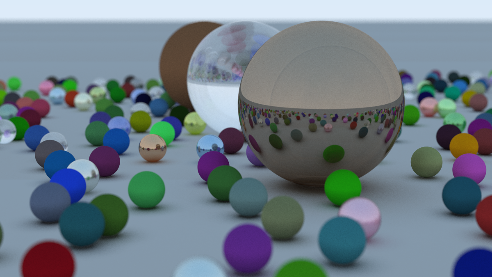

# Rayonetta

Blazing fast [raytracing in one weekend](https://raytracing.github.io/). Written in Rust.

## Some extra features

Not all this repository is copy-pasta. Some features that I felt like adding:

- Fibonacci sampling of the [sphere and unit disk](https://observablehq.com/@meetamit/fibonacci-lattices).

- Added a `Plane` class. I felt it was a more elegant solution than using a massive sphere.

- Parallelization via the [`rayon`](https://github.com/rayon-rs/rayon) crate. Sped-up the last renders by at least 4x.